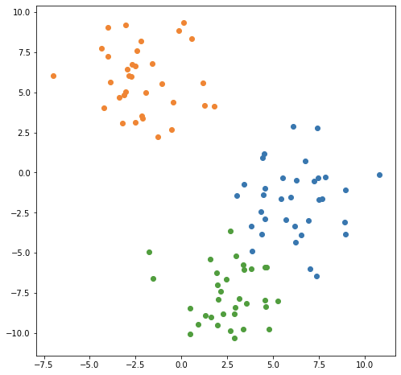

# KNN-Algorithm
 The k-nearest neighbors (KNN) algorithm is a simple, easy-to-implement supervised machine
 learning algorithm that can be used to solve both classification and regression problems.
 This algorithm is dependent on distance for classification, normalizing the training data can improve its accuracy dramatically.
 
<pre>
<li>It is used when: </li>
    - You have a bunch of objects that have been classified, and</li> 
    - You want a way to automatically clasify similar objects that haven’t gotten classified.</li> 

<li>Procedure of automation</li>
Step 1: Define similarity of two objects 
Step 2: Compare the similarity of a given unrated object with all the classified objects. 
Step 3: Take the most similar objects and call them neighbors, who each have a “label.” 
Step 4: Determine the "label" of the unrated object. 
</pre>

# Example 1
Let’s consider the simplest case of using a KNN model as a classifier. Let’s say you have data points that fall into one of three classes. A two dimensional example may look like this:

</img>

# Example 2
<pre>
For example, movie rating:

You have a bunch of movies that have been classified as “thumbs up” or “thumbs down,”. 
You want to classify the movie "Toy Story"  
    Step 1: Define the attributes of "Toy Story" 
           Length of movie 
           Genre 
           Number of Oscar-winning actors in it 
           Budget  
    Step 2: find the majority rating of other movies with similar attributes 
    Step 3: Assign rating to "Toy Story"  

If there is a majority rating, then the rating of "Toy Story" should have the same rating.
If there’s a tie, then the rating of "Toy Story" is randomlyassigned.
</pre>

# References
https://en.wikipedia.org/wiki/K-nearest_neighbors_algorithm  
https://towardsdatascience.com/the-basics-knn-for-classification-and-regression-c1e8a6c955
